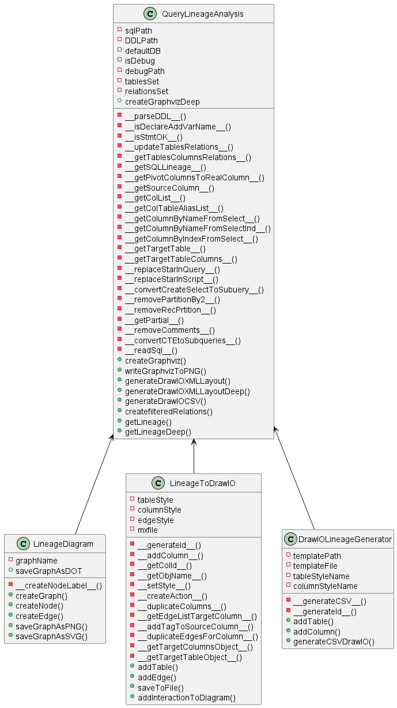
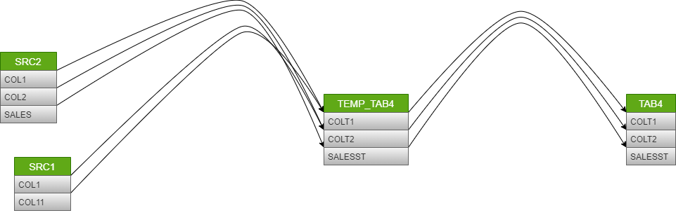
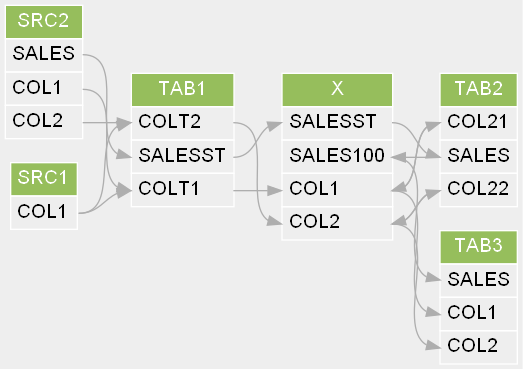

## Purpose:
This tool can be used to extract the column lineage from ETL scripts.
It will draw the lineage wither using graphviz or DrawIO.
Drawing using DrawIO has an additional feature which makes the diagram to
be interactive by showing the lineage for particular column when it is clicked.

## Classes:
The following diagram demonstrates the classes developed for this tool:

The developed classes are:
- [QueryLineageAnalysis](code/querylineage2.py):
This class is responsible for the following:
  * Reading and parsing the DDLs.
  * Reading and Parsing the SQLs which will be used in the getting the lineage.
  * Calling other classes to draw the returned lineage.
- [LineageDiagram](code/lineage_diagram.py): 
This class is responsible for the following:
  * Creating the graphviz format for the diagram using dot library
  * Saving the diagram as png, svg or text format using dot.
- [LineageToDrawIO](code/lineagetodrawio.py):
This class is responsible for the following:
  * Creating DrawIO file for the resulted lineage.
  * Adding interactivity on demand for the diagram.
  * Aligning the nodes in order not to overlap.

## Input file description:
The input for this tool is an ini file similar to [lineage_config.ini](config/lineage_config.ini)
Below are the possible fields and their descriptions:
- **_Section lineage_**:
  * **sql_path**: The full path for the sql scripts which will be used in 
  getting the lineage for particular table. One sql file is responsible 
  for inserting in one final target table. The name of the is "<target_table_name>.sql". 
  * **ddl_path**: The full path for the DDL sql scripts. each file is DDLscript for one table.
  * **target_table_name**: The target table name which the lineage will be created for.
  * **is_filter_intermediate**: Flag to indicate if we the tool to filter any intermmediate tables
  which belongs to specific database indicated by **<_intermediate_databases_>**
  * **intermediate_databases**: comma delimited list of intermediate databases 
  to be used by the tool to filter any intermediate tables belongs to these databases.
  * **defaultDB**: Default database if the database is not mentioned in the script or the table
  is a temp table.
  * **deep**: Flag to indicate if the lineage should be deep or just first level of lineage.
  * **debug**: Flag to throw logs while processing the scripts.
  * **debug_log**: Full path for the folder which will hold the logs which will be written.
  * **verbose**: output some text to indicate the progress and the processing time on the console.
- **_Section graph_**:
  * **type**: This will have values either "graphviz" or "drawio" to determine the type of graph.
  * **output_path**: The output path which will contain the output diagram file.
- **_Section graphviz_**:
  * **templatepath**: The full pth for the tmplate file to be used as initial template.
  * **templateFileName**: The file name of the template.
  * **background_color**: Hexadecimal representation to color which will be used in the background.
  * **font_name**: The font name.
  * **vertical_sep**: The space between the nodes vertically.
  * **horizontal_sep**: The space between the nodes horizontally.
- **_Section drawio_**:
  * **table_style**: The style and shape to be used for the nodes which will server as table. 
  The value should be surrounded by double quotes.
  * **column_style**: The style to be used for columns. The value should be surrounded 
  by double quotes. 
  * **edge_style**: The style and shape of the edges. The value should be surrounded 
  by double quotes.
  * **source_space_factor**: Factor to be used to create space between the tables vertically.
  * **source_target_space** Factor to be used to create space between the souces and
  target table horizontally.
  * **item_height**: The height of the item(column).
  * **is_interactive**: Flag to add interactivity to the diagram or not.
  * **stroke_color**: Hexadecimal value for the color to be used to the 
  edges when particular columns has been selected.
  * **stroke_width**: Integer value for the thickness of the edges when column has been selected.
  * **collapsed**: Flag to create the nodes collapsed or not.

## Prequisites:
This section ill list  the requireed things inorder to guarantee high accuracy fo the lineage:
Diagraming options:
- The columns in sql it is preferable to have them prefixed with the aliasof he table which they 
belong to.
- The DDLs for all the tables used should exist. It will help in identifiying the columns which
- not satisfy the previous point.
- The following keywords should be commented: **WHILE DO END WHILE,BEGIN,END, IF THEN ELSE END IF**
- Encoding of the files in UTF-8
## Files
 - [lineage_config.ini](./config/lineage_config.ini): Sample file for teh configuration to be passed to the tool.
 - [lineage_class_diagram.png](./images/lineage_class_diagram.png): Class diagram for the code.
 - [querylineage2.py](./code/querylineage2.py): This file contains the class QueryLineageAnalysis.
 - [lineage_diagram.py](./code/lineage_diagram.py): This file contains the class LineageDiagram.
 - [lineagetodrawio.py](./code/lineagetodrawio.py): This file contains the class LineageToDrawIO
 - [mainentry.py](./code/mainentry.py): This file contain the entry point for the tool.
To run this script from command line you need to path the full path for the configuration 
file with -p or --path prefix
 - [DDL/*.sql](./DDL/*.sql): This files contain sample for DDL scripts.
 - [sql/*.sql](./sql/*.sql): This files contain sample sql scripts.

## Limitations:
- The tool can't handle MERGE or update statements yet.
- Some preparation should be done on the SQL scripts before using the tool like removing 
the keywords discussed in previous section.
- The encoding of the input files should be UTF-8

## Sample screen shots
* Sample DrawIO diagram:

* Sample Graphvis diagram:

 
## Libraries